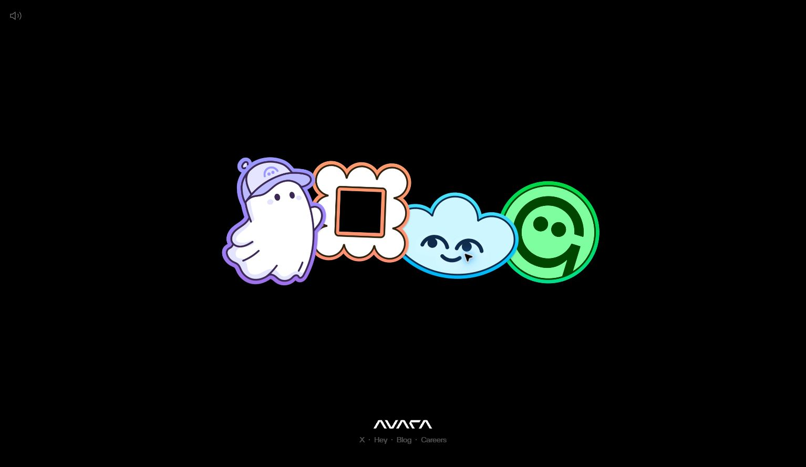

# Avara: интерактивный селектор предметов

- ID: `avara-selector`
- Референс: https://avara.xyz/
- Дата исследования и добавления: 2026-10-05
- Статус: **analysis-only** — собственная реализация отсутствует.

Главная — фиксированная DOM-сцена с четырьмя прозрачными 2D-иллюстрациями. Независимое плавание, увеличение и подпись при hover, свободный drag с упругим возвратом, переход от общей композиции к выбранному предмету и правой панели. На mobile ряд меняется на 2×2, выбранный предмет переносится вверх, а информация прокручивается как нижняя панель поверх неподвижной сцены. Overview не связан со scroll; глобальный pointer-parallax не обнаружен.

## Материалы

- [Полный разбор, все 19 страниц текста и скриншоты](analysis.md).
- [Самостоятельное задание для Codex](codex-prompt.md).
- [Предлагаемая интеграция и границы проверки](implementation.md).
- [Инструкция для Codex — PDF, 19 страниц](Инструкция%20для%20Codex.pdf).
- [Инструкция для Codex — TXT, UTF-8](Инструкция%20для%20Codex.txt).
- [Галерея 17 скриншотов](screenshots.md).
- [Источники, SHA-256 и статус доказательств](provenance.json).

## Ключевые механики

1. Overview → hover/press → drag → spring return без случайного открытия.
2. Click → detail; масштаб выбранного объекта увеличивается вдвое на desktop, контекстные соседи становятся полупрозрачными.
3. Циклический prev/next и клавиатура; закрытие возвращает композицию и фокус.
4. Breakpoint 920 px: мобильная сетка, выбранный объект наверху, отдельный scroll-контейнер панели.

Плавание, наклоны и пространственная непрерывность формируют характер. Звуки, анимация логотипа и brand-menu — необязательный декор. Blog/статья разобраны дополнительно; переносить их только по отдельному запросу. Careers ведёт на другой сайт и исключён.

## Точность и права

Исследование выполнено в Chrome: desktop 1534×889 и временный mobile viewport 390×844. Мобильная проверка использовала мышь/wheel, а не физический touch. DOM/CSS подтверждают 2D-изображения и Lottie SVG; Motion/Framer и Radix — вероятные зависимости, точные JS-параметры больших переходов неизвестны. WebGL/Three.js для этой механики не требуется.

Измерения оригинала, наблюдения, гипотезы и предлагаемые параметры обозначены отдельно. В архиве нет исходного кода Avara или собственной адаптации. Скриншоты включены для анализа и сравнения; это не лицензия на использование изображённых персонажей, логотипов, шрифтов или текстов в новом продукте. Используйте разрешённые материалы своего сайта.
